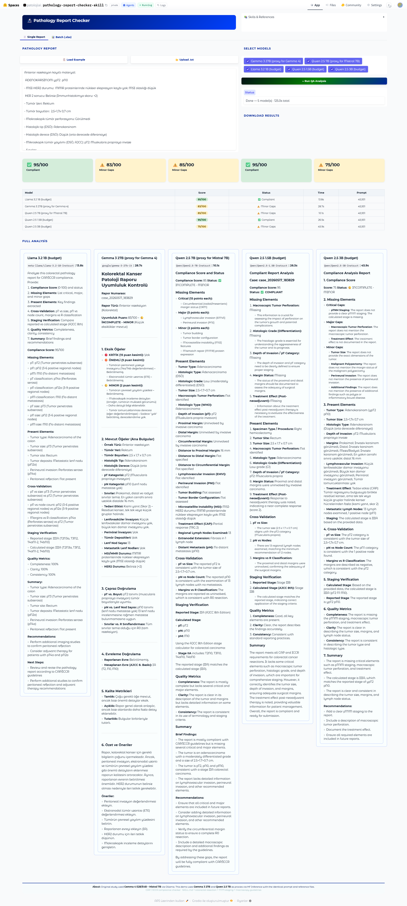
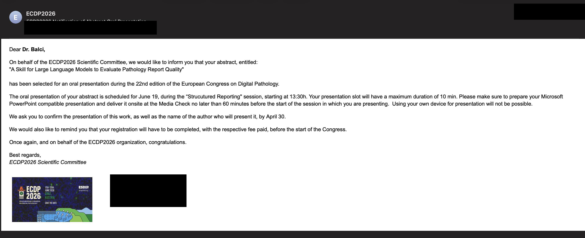

**A Claude skill for surgical pathology quality assurance.** It checks cancer
pathology reports for completeness against CAP and ICCR guidelines, validates
TNM staging (AJCC 8th edition), generates synoptic templates and tumor-board
summaries, converts free text to structured reports, and suggests SNOMED CT /
ICD-O-3 codes — in **English and Turkish**.

[⬇️ Download the `.skill`](https://github.com/patolojiAI/pathology-report-checker-skill/releases/latest/download/pathology-report-checker.skill){: .btn }
&nbsp;
[▶️ Live demo](https://reportskill.patoloji.app/){: .btn }
&nbsp;
[🤗 Hugging Face](https://huggingface.co/spaces/patolojiai/pathology-report-checker-skill){: .btn }
&nbsp;
[💻 Source on GitHub](https://github.com/patolojiAI/pathology-report-checker-skill){: .btn }

---

## 🎓 An academic project

This skill is the subject of a peer-reviewed academic study that was **selected
for an oral presentation at [ECDP2026](https://www.ecdp2026.org/)** — the **22nd
European Congress on Digital Pathology** (Graz, Austria, 17–20 June 2026).

> **A Skill for Large Language Models to Evaluate Pathology Report Quality**
> Pelin Balcı, Mehtat Ünlü, Sinan Nazlım, İlknur Türkmen, Serdar Balcı
> *Oral presentation — "Structured Reporting" session, 19 June 2026, 13:30.*

The study used this skill to evaluate **100 anonymized Turkish-language
colorectal resection reports** across cloud (Claude) and local (Mistral 7B via
Ollama) models, with independent review by two pathologists — assessing how
reliably large language models can audit free-text pathology reports.

See the [abstract](#-the-abstract) and [acceptance](#-conference-acceptance)
below.

---

## 🔬 What it does

- ✅ Checks report completeness against **CAP** and **ICCR** guidelines
- 🧬 Validates **TNM staging** (AJCC 8th edition), with pT/pN/margin cross-checks
- 📋 Generates **synoptic templates** (blank or pre-filled)
- 🧾 Creates concise **tumor-board summaries**
- 🔄 Converts **free-text** reports to structured synoptic format
- 🏷️ Suggests **SNOMED CT** and **ICD-O-3** codes
- ✏️ Drafts **amendments / addenda**
- 🌐 Works in **English and Turkish**

**Tumor types:** breast invasive carcinoma · colorectal resection · exocrine
pancreas carcinoma · gastric carcinoma.

---

## 🤗 Try it online

A hosted demo — no install required — at **[reportskill.patoloji.app](https://reportskill.patoloji.app/)**,
running on [Hugging Face Spaces](https://huggingface.co/spaces/patolojiai/pathology-report-checker-skill):

[](https://reportskill.patoloji.app/)

---

## 🚀 Use it in Claude

📺 **New to Claude?** This short video walks through installing the Claude
desktop app and adding a skill:

<div style="max-width:760px; margin:1rem 0;">
  <div style="position:relative; padding-bottom:56.25%; height:0; overflow:hidden; border-radius:6px;">
    <iframe src="https://www.youtube.com/embed/pXIkpDMyTG4" style="position:absolute; top:0; left:0; width:100%; height:100%; border:0;" title="Install the Claude desktop app and add a skill" allow="accelerometer; autoplay; clipboard-write; encrypted-media; gyroscope; picture-in-picture; web-share" allowfullscreen></iframe>
  </div>
</div>

**Option A — Claude.ai / desktop app (no terminal):**

1. [Download `pathology-report-checker.skill`](https://github.com/patolojiAI/pathology-report-checker-skill/releases/latest/download/pathology-report-checker.skill)
   (right-click → *Save Link As…*).
2. In Claude.ai, open **Settings → Capabilities → Skills → Upload skill** and
   select the file.
3. Paste or upload a report and use a trigger phrase, e.g.
   *“Check this report for CAP compliance.”*

**Option B — Claude Code:**

```bash
git clone https://github.com/patolojiAI/pathology-report-checker-skill.git
ln -s "$(pwd)/pathology-report-checker-skill" ~/.claude/skills/pathology-report-checker
```

**Trigger phrases** (English or Turkish):

```
Check this pathology report for CAP/ICCR compliance
Generate a synoptic template for colorectal resection
Calculate TNM stage for pT2 N1 M0 breast cancer
Generate a tumor board summary
Bu patoloji raporunu CAP/ICCR uyumluluğu için kontrol et
```

Full usage, batch processing, and the complete trigger catalog are in the
[README](https://github.com/patolojiAI/pathology-report-checker-skill#readme).

---

## 📄 The abstract

**A Skill for Large Language Models to Evaluate Pathology Report Quality**
*Pelin Balcı (Beko AI Research & Development); Mehtat Ünlü, Sinan Nazlım,
İlknur Türkmen, Serdar Balcı (Memorial Healthcare Group, Department of
Pathology).*

A complete pathology report is essential for patient management and
accreditation. While synoptic and structured reports are becoming standard,
free-text reporting remains common. We developed a **Skill for large language
models** to extract information and validate report quality against ICCR
required elements, TNM logic, macroscopic features, and inter-report integrity.
One hundred anonymized Turkish colorectal resection reports were evaluated with
the Skill via Claude, compared against GPT-5.3-codex and an independent review
by two pathologists, with a local run on **Mistral 7B via Ollama** to
demonstrate on-premise deployment. The Skill parsed most required parameters and
flagged report completeness; pathologist review revealed both false positives
and false negatives (mesorectum grading on non-rectal specimens, lymph-node
miscounts, combined pTN-notation parsing, and unrecognized Turkish terminology).
Pathology report quality skills appear promising for both cloud and local
models and could serve as a **pre-sign-out check** integrated into routine
reporting workflows.

*Keywords: large language models, skills, guidelines, pathology report, quality
assurance.*

[⬇️ Download the full abstract (PDF)](assets/ecdp2026-abstract.pdf)

<iframe src="assets/ecdp2026-abstract.pdf" width="100%" height="640" style="border:1px solid #ddd; border-radius:6px;" title="ECDP2026 abstract PDF"></iframe>

---

## 📨 Conference acceptance

[](assets/ecdp2026-acceptance.jpeg)

*Notification of abstract oral presentation — ECDP2026 Scientific Committee.*

---

## 📐 Guidelines referenced

| Organization | Standard |
|---|---|
| **CAP** | Cancer Protocol Templates (2024) |
| **ICCR** | Cancer Datasets (2nd edition) |
| **AJCC** | TNM Staging Manual (8th edition) |
| **AAPA** | Macroscopic Examination Guidelines (3rd edition) |
| **WHO** | Classification of Tumours (5th edition) |

---

## 📝 How to cite

> Balcı P, Ünlü M, Nazlım S, Türkmen İ, Balcı S. *A Skill for Large Language
> Models to Evaluate Pathology Report Quality.* 22nd European Congress on Digital
> Pathology (ECDP2026), Graz, Austria, 2026. Oral presentation.

---

## 🔗 Links

- **Live demo:** [reportskill.patoloji.app](https://reportskill.patoloji.app/) — on [Hugging Face Spaces](https://huggingface.co/spaces/patolojiai/pathology-report-checker-skill)
- **GitHub repository:** <https://github.com/patolojiAI/pathology-report-checker-skill>
- **Latest `.skill` release:** <https://github.com/patolojiAI/pathology-report-checker-skill/releases/latest>
- **Related skill collection:** [pathologyskills.patoloji.dev](https://pathologyskills.patoloji.dev/) · <https://github.com/patolojiAI/pathology-skills-collection>

---

## ⚕️ Disclaimer

This tool assists surgical pathology quality assurance and **does not replace
clinical judgment**. It is provided for research and educational use under the
[MIT License](https://github.com/patolojiAI/pathology-report-checker-skill/blob/master/LICENSE).
